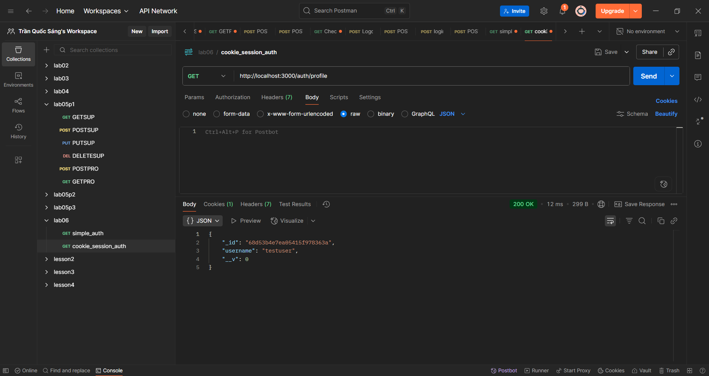

Cookie Session Authentication - POSTMAN TEST

PHAN 1: USER REGISTRATION TEST

Buoc 1: Test register user moi
Method: POST
URL: http://localhost:3000/auth/register
Headers: Content-Type: application/json
Body (raw JSON):
{
  "username": "testuser",
  "password": "testpass123"
}
Ket qua: User registered successfully!
Status: 200

Buoc 2: Test register user da ton tai
Method: POST
URL: http://localhost:3000/auth/register
Headers: Content-Type: application/json
Body (raw JSON):
{
  "username": "testuser",
  "password": "anypass"
}
Ket qua: User registration failed
Status: 400

PHAN 2: LOGIN TEST

Buoc 3: Test login sai username
Method: POST
URL: http://localhost:3000/auth/login
Headers: Content-Type: application/json
Body (raw JSON):
{
  "username": "wronguser",
  "password": "testpass123"
}
Ket qua: Invalid username or password
Status: 400

Buoc 4: Test login sai password
Method: POST
URL: http://localhost:3000/auth/login
Headers: Content-Type: application/json
Body (raw JSON):
{
  "username": "testuser",
  "password": "wrongpass"
}
Ket qua: Invalid username or password
Status: 400

Buoc 5: Test login dung credentials
Method: POST
URL: http://localhost:3000/auth/login
Headers: Content-Type: application/json
Body (raw JSON):
{
  "username": "testuser",
  "password": "testpass123"
}
Ket qua: Login successful!
Status: 200
CHU Y: Postman tu dong luu session cookie connect.sid

Buoc 6: Kiem tra session cookie
Vao tab Cookies trong Postman
Tim cookie connect.sid
Xem gia tri session ID

PHAN 3: PROTECTED ROUTE TEST

Buoc 7: Test profile route khong co session
Mo Postman tab/window moi (hoac xoa cookies)
Method: GET
URL: http://localhost:3000/auth/profile
Ket qua: Unauthorized
Status: 401

Buoc 8: Test profile route co session hop le
Method: GET
URL: http://localhost:3000/auth/profile
CHU Y: Dung tab da login o Buoc 5
Ket qua: Thong tin user (khong co password)
Status: 200

PHAN 4: LOGOUT TEST

Buoc 9: Test logout
Method: GET
URL: http://localhost:3000/auth/logout
Ket qua: Logout successful!
Status: 200
CHU Y: Session va cookie bi xoa

Buoc 10: Test profile sau khi logout
Method: GET
URL: http://localhost:3000/auth/profile
Ket qua: Unauthorized
Status: 401

